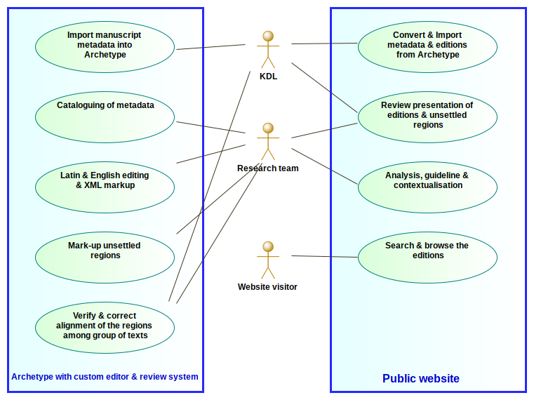
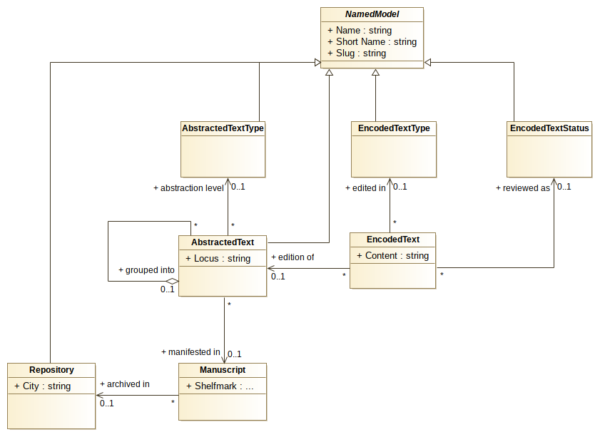
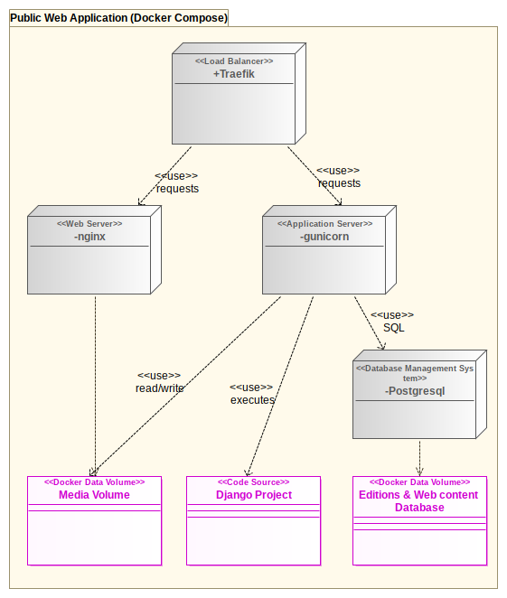

# Research Software documentation of COTR

This page contains a high-level documentation of the research software analysed, 
designed and developed by [King's Digital Lab (KDL)](https://kdl.kcl.ac.uk) 
for the [The Community of the Realm in Scotland, 1249-1424: history, law and charters in a recreated kingdom (COTR)](https://cotr.ac.uk/) 
research project.

Please refer to [the Guideline section on the COTR website](https://cotr.ac.uk/guidelines/) 
for the historical and research perspective on the project and ways to cite our work.

KDL team: Paul Caton, Ginestra Ferraro, Brian Maher, Geoffroy Noël, Miguel Vieira.

## UML Model

All Unified Modeling Language (UML) diagrams below were drawn with [Modelio](https://www.modelio.org/)
you can [download the complete model and diagrams in a single Modelio zip file](./uml/ctrs-modelio.zip)
or download the model in XMI format: [UML 2.1](./uml/XMI/ctrs-uml21.xmi), 
[UML 2.4](./uml/XMI/ctrs-uml24.xmi) or [UML-EMF 3.0](./uml/XMI/ctrs-emf3.xmi).
*Note that although the XMI format is standard but isn't rarely well exchanged among UML editors. 
Also note that XMI files don't contain the diagrams.*.

## Editorial Workflow

UML Use case diagram:

The complete workflow spans across two systems:
* a private [COTR instance of the Archetype framework](https://github.com/kingsdigitallab/ctrs-archetype) with a [customised text editor and review system](https://github.com/kingsdigitallab/ctrs-archetype/wiki/Editing-the-texts-with-Archetype) for the unsettled regions 
* the public project website as described in the [System Architecture section](#system-architecture)

Workflow steps generally occurred in the following order: from top-left corner going down then moving to the top right corner and going down.
Note that the workflow isn't strictly linear, reviewing steps obviously lead to corrections up the editorial chain.
Moreover some versions were edited first and published before others. 

Since KDL works in an agile fashion, the steps were developed, tested and used incrementally
and iteratively. This allowed us to give the researchers a working environment they can
work on before it was fully functional. Indeed, our encoding model for the unsettled regions
came quite late as we needed some draft manuscript and version XMLs to help us 
analyse those specific requirements and design an encoding schema that works well across both system
and isn't too complicated for the editors.

The manuscripts metadata were imported into Archetype by a python script 
from an Excel spreadsheet provided by the research team.
Further cataloguing was done using the existing backend environment within Archetype.

The conversion of the content from Archetype to the Public system is automated thanks
to the Archetype Data API.

The adoption of Archetype helped us save a lot of development time and focus 
directly on additional features such as the text encoding and the synchronisation 
of the regions across the various texts. Three of the research partners were already 
familiar with the framework through their participation in the 
[Models of Authority](http://www.modelsofauthority.ac.uk/) project (developed by DDH).

However, given that Archetype is a legacy application built on an obsolete software stack
this customised instance cannot be maintained much longer beyond the end of this project.
It will be taken down, packaged up as a docker instance for archival on github. 
At which point the editions on the live website are considered final.

## Data Model

The [conceptual data model](https://cotr.ac.uk/guidelines/dynamic-edition-key-concepts/) was created by Paul Caton in collaboration with the research team.

This was later adapted into a logical model by Geoffroy Noel 
to facilitate [our implementation]((https://github.com/kingsdigitallab/cotr/blob/master/cotr/ctrs_texts/models.py)) 
in [Django ORM](https://docs.djangoproject.com/en/3.1/topics/db/models/) 
and the derived database schema. 

UML Class diagram:

The main difference with the conceptual model is the generalisation of the concept of group.
In COTR a version represents of group of texts abstracted from a manuscripts.
Here we consider a work as group of versions. We thus have a hierarchy of groups:
manuscripts into version, versions into work. 
This is modeled by the recursive association (`grouped into`) from AbstractedText to itself 
and the `AbstractedTextType` class which represents the level in the grouping hierarchy: 
"manuscript", "version" or "work".
Only an `AbstractedText` of type "manuscript" can be linked to a `Manuscript` instance and has a "locus".
Versions and Work obviously cannot be located into a single physical document.

There are actually two dimensions of abstractions: 
* the interpretive extraction of the handwritten content from the manuscript (which abstracts [other aspects of the Manuscripts](https://epierazzo.blogspot.com/2013/) (e.g. codicology) as well as the exact form of the written text (e.g. abbreviations, spelling))
* the grouping that implies an ideal text from a multiplicity of members (which abstracts singular readings - [encoded with a special symbol ⊕](https://cotr.ac.uk/guidelines/dynamic-text/version-v-text/))

Since each AbstractedText is edited in Latin and in English by the researchers, 
we have also generalised that aspect into the `EncodedText` class. 
The class represents a single edition of an `AbstractedText` 
and its attribute `Content` holds the text marked-up as XML ([see Encoding section below](#encoding-of-the-texts)).
`EncodedTextType` specifies the type of edition: "transcription" or "translation".
`EncodedTextStatus` represents the editorial status of the EncodedText: "draft", "public". 
Only editions marked as "public" are visible on the public website.

### Technical note

`NamedModel` is a special class, each class connected to it inherits from its attributes:
* `Name`: a fully descriptive label that can be displayed on screen
* `Short Name`: a shorthand (e.g. a siglum, or an abbreviated form)
* `Slug`: [an memorable identifier](https://developer.mozilla.org/en-US/docs/Glossary/Slug)

For instance an AbstractedText could have the following attributes:
* Name: Edinburgh, NLS, MS Adv. 35.1.7, pp.345–346
* Short Name: CA   (its siglum)
* Slug: edinburgh-nls-ms-adv-3517-pp345346
* Locus: pp.345–346

## Web APIs

[See separate documentation of the public Web APIs to search and browse the editions](apis.md). 

## Encoding of the texts

The XML encoding of the texts is an adaptation of [TEI](https://tei-c.org/) semantic into XHTML format. 
It can therefore be directly displayed
and edited in the web-based Text Editor of Archetype and rendered directly on the live 
website with CSS styling. However although the mark-up is valid HTML, it is designed
to map unambiguously to TEI. It is possible to export any text into TEI by applying
an XSLT transform. The XHTML content is saved in the relational database for 
long term storage alongside a plain text derivative for indexing and live searches. 
This approach has been used in many projects based on the Archetype framework; it is web-friendly and integrates very well with the
rest of the rich editorial environment.

The texts can be downloaded in TEI format with the [Web API](./apis.md).

## System Architecture

UML Deployment diagram:

The web application was developed using two python 3 web frameworks:
* [Django](https://www.djangoproject.com/)
* [Wagtail Content Management System](https://wagtail.io/)

We have used the [Django Cookie Cutter](https://github.com/cookiecutter/cookiecutter) 
stack, which is deployed with [Docker](https://www.docker.com/) and comes with postgresql for the relational database, 
nginx as a web server for the media assets, gunicorn to run the Python application and Traefik as a reverse proxy.

The [source code of the Django project](https://github.com/kingsdigitallab/cotr/tree/master/cotr) 
itself is open source and included in [this COTR repository](https://github.com/kingsdigitallab/cotr).

The [search page](https://cotr.ac.uk/search/) and the [text viewer](https://cotr.ac.uk/viewer?group=declaration&blocks=23:transcription;) 
on the public website are implemented by the [ctrs_text Django app](https://github.com/kingsdigitallab/cotr/tree/master/cotr/ctrs_texts).

Each node (grey box) in the above diagram is a separate Docker container. 
See the [docker-compose file](https://github.com/kingsdigitallab/cotr/blob/master/kdl_liv.yml) 
for the specification details. 

